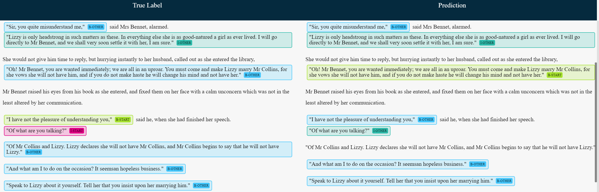
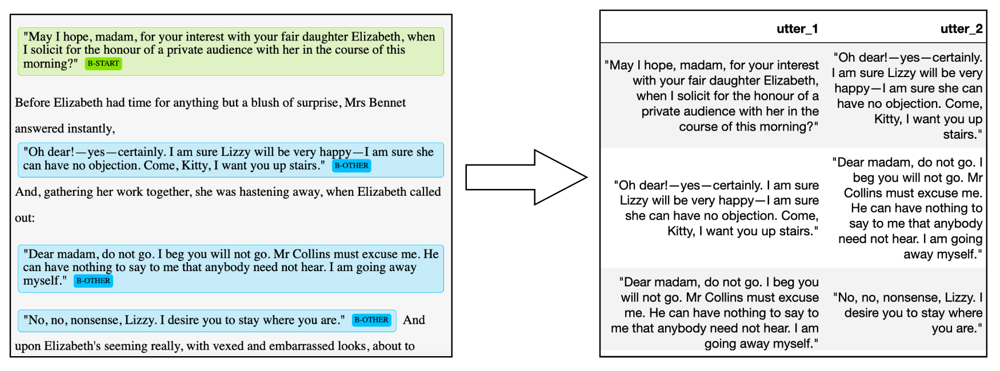

# Mining Conversations from Novels

  



## Table of contents

- [Introduction](#introduction)
  - [Quick Summary](#quick-summary)
  - [Motivation](#motivation)
  - [Why Is this a challenge?](#why-is-this-a-challenge)
- [Identifying Conversations](#identifying-conversations)
  - [Data](#data)
  - [Preprocessing](#preprocessing)
  - [Methodology](#methodology)
    1. [Heuristic](#heuristic)
    2. [Sequence Labeling (BERT+BiLSTM+NER)](#sequence-labeling-(bert-bilstm-ner))

* [Results](#results)

- [Constructing Utterance Pairs](#constructing-utterance-pairs)
- [Conclusion](#conclusion)
  - [Closing Thoughts](#closing-thoughts)
  - [Future Work](#future-work)
- [Quick Start](#quick-start)
  - [Requirements](#requirements)
  - [Download Dataset](#download-dataset)
  - [Access NER visualizer](#access-ner-visualizer)
  - [NER Tf-2 Starter Code](#ner-tf-2-starter-code)
- [Resources](#resources)
  - [Embeddings](#embeddings)
  - [References](#references)
- [Contact](#contact)

------

# Introduction

*'Begin at the beginning,' the King said gravely, 'and go on till you come to the end: then stop.'* 

​													- King of Hearts, Alice in Wonderland (1865)

#### Quick Summary

The objective of this project is to compare methods for mining **conversations** from **narrative fiction**.

#### Motivation

Firstly, dialogue systems need natural language data. A lot of it, and the richer the better. Exciting advances in dialogue systems such as Google Duplex and Microsoft Xiaoice have been powered by deep learning models trained on rich and diverse types of conversations. For instance, XiaoIce is trained to be able to switch between 230 conversational modes or 'skills', ranging from comforting and storytelling to recommending movies after being trained on examples of conversations from each category.

Such data sources are hard to come by. Existing methods include mining reddit and twitter for conversational pairs and sequences. These methods face limitations because of the linguistic and content differences between online communication and regular human conversation, not to mention the negativity bias of internet content, seen in the infamous Microsoft "Tay" bot. Some teams have resorted to collecting human-generated conversational data through crowd-sourcing tools such as Amazon Mechanical Turk. Unfortunately, these methods are expensive, slow, and do not scale well.

There is another way.

A treasure trove of varied and life-like conversational data lies within the pages of narrative fiction. Conversation in narrative fiction is rich and varied in ways that existing corpora are not. Research has found that many of the linguistic and paralinguistic features of dialogue in fiction  are similar to natural spoken language. They also contain different actors with different intentions and relationships to one another, which could potentially allow a data-driven dialogue system to learn to personalize itself to different users by making use of different interaction patterns. Additionally, real-life dialogue is a role-playing 'language game' of sorts between turn-taking strategic agents, and we would like data that can capture this.

Furthermore, this project is also valuable for digital humanities researchers who want to conduct large-scale studies of dialogue in fiction.

#### Why is this a challenge?

Identifying conversations in narrative fiction is tricky. Where does one conversation end, and another begins? Stylistic and lexical features vary greatly across literary works and time periods. For instance, in some works, speaker attribution is clear, i.e. "The car is red," she said. In others, it is not, i.e. "The car is red". "Indeed it is". 

Simply picking out consecutive words enclosed in quotation marks "…", "…" will not work, because some conversations are interspersed with additional narration.

Finally, and most importantly, a lot of the information about conversation in fiction is contained not in dialogue text itself, but in the exposition. Narrative exposition may add context to the ongoing conversation. It may also signal a change in conversational or situational context and thus the beginning of a new narrative sequence. Thus, any method that looks purely at the conversational utterances is likely to fall short.

# Identifying Conversations

#### Data

Our data consists of all the text in *Pride and Prejudice* by Jane Austen. We chose the novel as our data because it contains several appealing qualities. 

##### Why Pride and Prejudice?

Firstly, it is a novel that is particularly rich in the relationship between dialogue and plot. A leading Austen scholar characterises her novels as "Conversational Machines", in which words are traded in a "complex role-playing game" (Morini 2009). 

Secondly, it comes from a period in the history of the English language novel in which authors attempted to recreate dialogue as realistically as possible instead of the more abstract, experimental means used in later periods. 

Thirdly, it is easily and legally accessible as in HTML from the open-source website **Project Gutenberg** as its copyright has expired. This also means that our entire development pipeline will be directly applicable to the other ~58,000 texts hosted on Project Gutenberg.

#### Preprocessing

We input html files containing the complete text of narrative fiction hosted on [Project Gutenberg](<https://www.gutenberg.org/>). 

Then, a Python parser extracts text within ```<p>``` tags and ``<h2>`` tags and outputs a csv file with each paragraph as a row. Utterances and non-utterances are also tagged as such using a collection of simple rules.

Inspired by the sequence-labelling scheme typically used in Named-Entity-Recognition, we use the following schema to manually assign labels to our text paragraphs:

 For each utterance, we assign

- `B-START` to first utterance in the conversation
- `I-START` if it the utterance following `B-START` is by the same speaker
- `B-OTHER ` if a speaker other than the one making the preceding utterance enters the conversation
- `I-OTHER` if the next utterance following an utterance assigned a `B-OTHER` tag belongs to the very same speaker

Note that we our approach does not track identities of speakers, only changes of speakers.

If, on the other hand, a paragraph is not an utterance and is instead exposition, we assign:

- `O`, which stands for "Outside"

For example, the first few paragraphs of our text will be tagged as such:

```
It is a truth universally acknowledged, that a single man in possession of a good fortune,
must be in want of a wife. {O}

However little known the feelings or views of such a man may be on his first entering a
neighbourhood, this truth is so well fixed in the minds of the surrounding families, that 
he is considered the rightful property of some one or other of their daughters. {O}

“My dear Mr. Bennet,” said his lady to him one day, “have you heard that Netherfield Park 
is let at last?” {B-START}

Mr. Bennet replied that he had not. {O}

“But it is,” returned she; “for Mrs. Long has just been here, and she told me all about it.” {B-OTHER}

“Do you not want to know who has taken it?” cried his wife impatiently. {I-OTHER}
```


#### Methodology

It is clear that there isn't a simple set of rules one can use to extract conversations. We propose that solving this task would require a model that can detect very subtle and complex correlations between the narrative text and dialogue. It would also need to readily identify sequences of text. 

Thus, we decided to model this problem as an NER-inspired sequence-labelling task. We trained several sequence-labeling models implemented in **TensorFlow 2.0**. We compare it against a **heuristic**.

We evaluate our models using two types of metrics. 

1. Direct **comparison of sequence labels** such as `B-START`.
2. **Comparison of utterance pairs** built from the models' predictions. 

##### Heuristic 

A heuristic is designed to identify conversations in an unsupervised way. We used the following assumptions:

1. All utterances in every paragraph are from the same speaker (this one-speaker-per-paragraph property is rarely violated in novels).
2. We mark an utterance as the start of a new conversation based on two conditions:
   - There are 3 sentences of narrative-type between previous utterance and the candidate utterance.
   - Candidate utterance is the first utterance of a chapter.

We hope to design a usable heuristic, which is able to reliably parse and identify any fiction from project Gutenberg. To evaluate our attempt, we will review the reliability and accuracy of this heuristic—in identifying conversations and constructing utterance pairs.

##### Sequence Labeling (BERT-BiLSTM-NER)

Our main approach uses a BERT embedding+BiLSTM architecture to perform a sentence-level sequence-labelling task. The model takes 4 paragraphs as input and analyzes the conversation entities (as listed above) at sentence level.

Being one of the latest state-of-art algorithm, BERT applies bidirectional transformer training on the language model which gives one of the best pre-trained embedding available across many NLP tasks.The team selected BERT pre-trained embeddings with average operator to achieve sentence level embedding on the extracted paragraphs.

Besides experiementing with different input sizes, we also explored LDA, TF-IDF, doc2vec approach to which BERT embedding outperforms on the NER task. 

#### Results

| Model                 | Recall (`B-START`) | Precision (Utterance-Pair) | Directory                               |
| --------------------- | -------------- | -------------------------- | --------------------------------------- |
| Convo miner heuristic | 0.50           | 0.89                       | `fiction_convo_miner/heuristic/`        |
| BERT-BiLSTM-NER       | **0.70**       | **0.93**                   | `fiction_convo_miner/seq_labeling_ner/` |

The table above compares the results of the 2 types of solutions we built. The sequence-labelling model with the BERT + BiLSTM architecture is best-performing one in absolute terms across 2 metrics.

The **Recall** of `B-START` measures the percentage of total relevant results correctly classified by the algorithm. This means that 50% of all true labels were predicted correctly by the heuristic method. On the other hand, our sequence-labelling model correctly predicts 70% of all true labels. In other words, the NER model correctly identified 70% of all conversation starters.

The **Precision** of the utterance pairs is the proportion of predicted pairs that are relevant. At 89%, the heuristic managed to capture 89% meaningful utterance pairs, with the remaining 11% to be falsely paired utterances. The precision of the sequence-labelling model sits at 93%, beating the precision of the heuristic. 

In conclusion, our theoretical motivations were validated by the results. Our sequence-labelling model was able to far better mine conversations from text. We suggest, in line with our theoretical convictions, that it could do so because it can take account the sequential nature of conversations in fiction as well as the highly complex correlations between narration and dialogue in the text. 

While NER method is better than a well-thought-out heuristic, a precision of 93% also mean that 7% of pairs generated are false. We must continue to question ourselves on the implication of using conversations from literary fiction. It may be a treasure trove, but our experiment was conveniently isolated to one fiction. We hoped to attend to bigger concerns, in applying transfer learning across different types fiction.

# Constructing Utterance Pairs

Utterance pairs, or context-reponse pairs, or dialogue pairs, are often used as training data when building dialogue systems. With this in mind, we proceed to construct utterance pairs based on the conversations identified by our models.



The box on the left shows a sample of our predictions, and on the right shows a sample of generated utterance pairs. 

We construct utterance pairs by taking a `B-START` utterance and pair them with the next utterance in the sequence, ignoring all `O`. Continue for each utterance and stop the pairing at the utterance just before the next `B-START`. 


# Conclusion

#### Closing Thoughts

Identifying conversations from narrative fiction seemed like a difficult, even insurmountable problem. However, our model was surprisingly successful, and can identify the beginnings of conversations 70% of the time.

Our experiment has provides evidence for the idea that sequence-labelling performed by the latest deep-learning methods outperform heuristics for extracting conversations from narrative fiction. The combination of the LSTM and Transformer architectures allows the model to capture both the highly complex syntactic and morphological aspects of speech and their sequential nature.

There remain challenges and limitations to our approach. Our data, *Pride and Prejudice*, presents dialogue in a rather straightforward and regular fashion, with utterances enclosed in quotation marks separated out into distinct paragraphs. To create a model that generalizes properly to more types of fiction, we will have to train the model on more diverse types of text to achieve a truly general conversational miner model.

In sum, it is an exciting time to be in dialogue systems. We can now engineer systems to be empathetic (XiaoIce), speak with human-like expressive range (Google Duplex), communicate with Dementia (Endurance) and tell stories (Talk to Judy). At the core of these advances are deep learning architectures trained on large and highly-curated samples of conversational data. We hope that our model would help support further advances by introducing a scalable means of extracting more of such data from literary fiction.

#### Future Work

- Write Tests for the parser and heuristic scripts.
- Label more examples of different types of narrative fiction and train the model on them for better generalization results.
- Evaluate possible ways to apply DL approaches across different types of fiction in order to generate conversations that contain specific properties (theme, mood, personality etc.)
- Applying our model on more of the 58,000 texts in Project Gutenberg to generate large-scale conversational corpora from fiction. We will then Open-Source the data for future researchers/engineers.

# Quick Start

#### Requirements

```
pip install -r requirements.txt
```

#### Download Dataset

[Pride and Prejudice Labeled data](https://github.com/longwind48/Automated-Fictional-Dialogue-Corpus-Extractor/blob/master/data/labeled/iob-labeled-sent-final-060519-v2.csv)

#### Access Sequence-Labeling Visualizer

We built a simple visualization tool for displaying our model predictions and heuristic predictions. Load it up!

```
python ner_visualizer/app.py
```

#### Heuristic Code

First parse a html book by running [./fiction_convo_miner/parse.py](./fiction_convo_miner/parse.py). Then run [./fiction_convo_miner/heuristic/heuristic_rb.ipynb](./fiction_convo_miner/heuristic/heuristic_rb.ipynb)

#### NER Tf2.0 Starter Code

Feel free to re-run our notebook in Google Colab. Or use it as a starter code!

> Run ./fiction_convo_miner/sequence_labeling_ner/fiction_bert_lstm_train_v4_4bs_final.ipynb
>
> or
>
> [](https://colab.research.google.com/github/longwind48/Automated-Fictional-Dialogue-Corpus-Extractor/blob/master/fiction_convo_miner/seq_labeling_ner/fiction_bert_lstm_train_v4_4bs_final.ipynb)

# Resources

#### Embeddings

[GloVe: Global Vectors for Word Representation,](https://nlp.stanford.edu/pubs/glove.pdf)

[google-research/BERT](https://github.com/google-research/bert)

[bert-embedding pypi](https://bert-embedding.readthedocs.io/en/latest/)

#### References

[A large annotated corpus for learning natural language inference,](https://nlp.stanford.edu/pubs/snli_paper.pdf)

[Keras SNLI baseline example](https://github.com/Smerity/keras_snli)

[A Survey of Available Corpora for Building Data-Driven Dialogue Systems](https://arxiv.org/pdf/1512.05742.pdf)

[10 innovative chatbots](https://www.wordstream.com/blog/ws/2017/10/04/chatbots)

[Google Duplex](https://ai.googleblog.com/2018/05/duplex-ai-system-for-natural-conversation.html)

[The Design and Implementation of XiaoIce,an Empathetic Social Chatbot](https://arxiv.org/pdf/1812.08989.pdf)

[The Ubuntu Dialogue Corpus: A Large Dataset for Research in Unstructured Multi-Turn Dialogue Systems](https://arxiv.org/pdf/1506.08909.pdf)

[Personalizing Dialogue Agents: I have a dog, do you have pets too?](https://arxiv.org/abs/1801.07243)

[Training Millions of Personalized Dialogue Agents](https://www.topbots.com/most-important-conversational-ai-research/#ai-chat-paper-2018-4)

[I Know The Feeling: Learning To converse with Empathy](https://arxiv.org/pdf/1811.00207.pdf)

[Psychological, Relational, and Emotional Effects of Self-Disclosure After Conversations With a Chatbot](https://academic.oup.com/joc/article-abstract/68/4/712/5025583)

[Creating an Emotion Responsive Dialogue System](https://uwspace.uwaterloo.ca/bitstream/handle/10012/14026/Vadehra_Ankit.pdf?sequence=1&isAllowed=y)

[Learning Personas from Dialogue with Attentive Memory Networks](https://arxiv.org/pdf/1810.08717.pdf) 

# Contact

[Traci](longwind48@gmail.com), [Joyce](), [LiJie](), [Rocco](), [LingXiao](), [Ray](geledek@gmail.com)